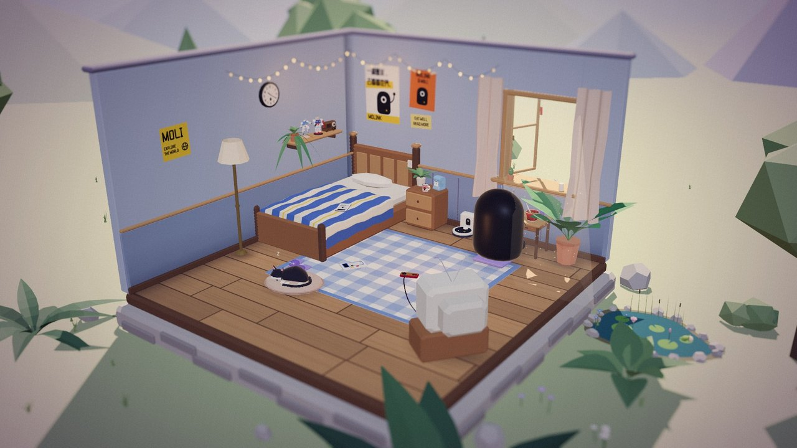
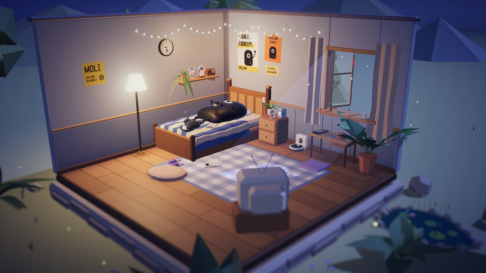
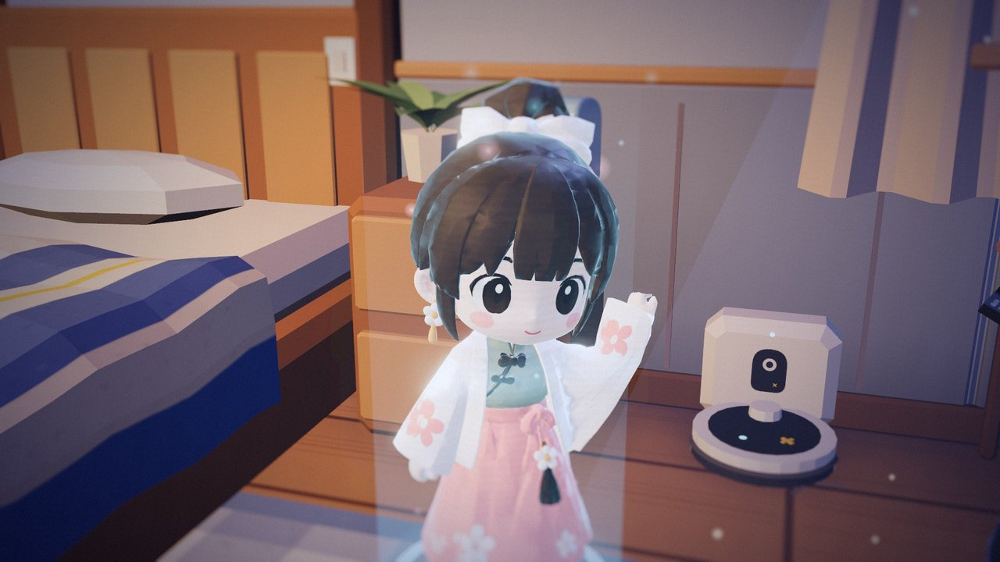
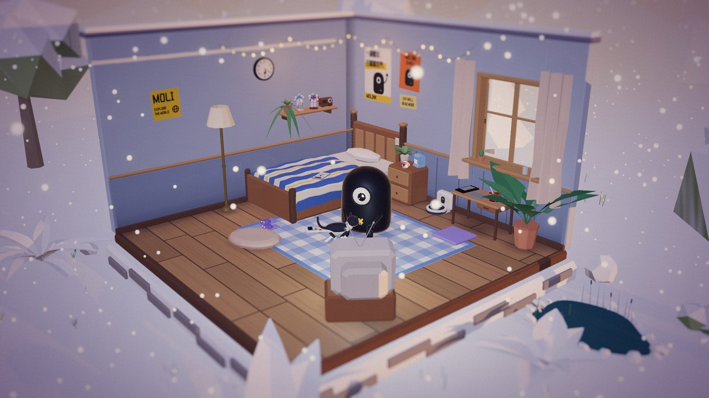
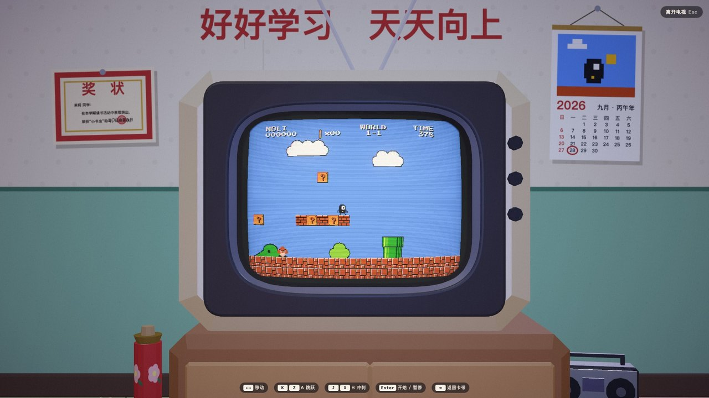
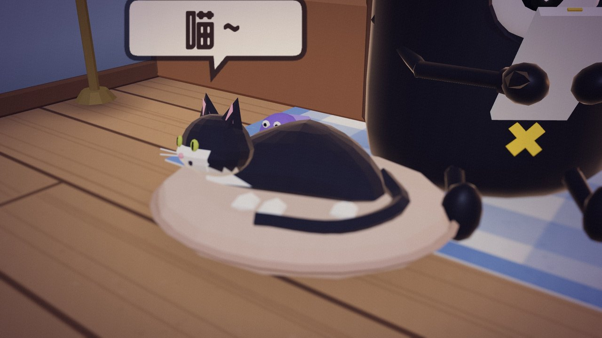
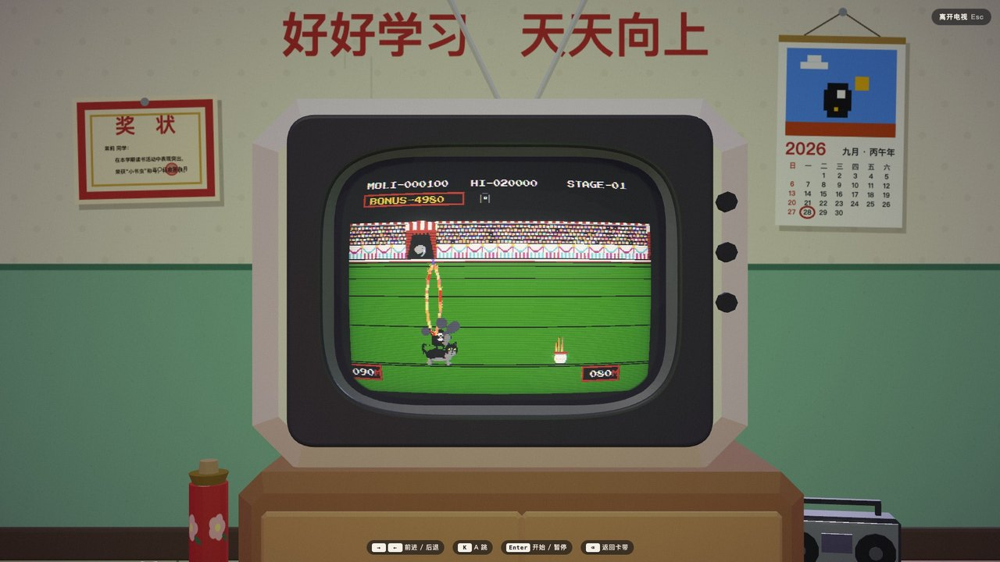

# 茉莉的小房间 · Moli's Room

> 墨灵阅读器吉祥物「茉莉」的 3D 小房间 —— 她会跟着你所在城市的真实时间与天气生活。
> A tiny 3D room for MOLI, the mascot of the MOLINK e-reader. She lives by your real local time and weather.

**在线体验 / Live：** https://moli.iaura.io



## 功能 Features

- **真实世界同步**：按所在城市的真实时间计算太阳高度、昼夜光照；实时天气（晴 / 雨 / 雪 / 雾）落进窗外和房间里。
- **茉莉的一天**：看书、打游戏、听音乐、吃饭、睡觉……按时间表自己生活，夜里会自动开落地灯。
- **小猫与扫地机**：点点小猫会喵喵叫，扫地机器人会在房间里巡逻。
- **电视 4 合 1 游戏机**：超级茉莉、魂斗茉莉、茉莉方块、茉莉马戏团，键盘 / 触屏可玩。
- **环境音混音台**：风、雨、雪、鸟鸣、虫鸣、蛙声、雷声、风铃，跟随真实天气或像白噪音 App 一样手动开关；另有收音机电台。
- **Aura 联动彩蛋**：南闲的桌面 AI 伙伴 Aura 会以全息投影的形式来房间串门。
- **中文 / English** 双语界面，手机与电脑均可访问。
- **纯前端**：three.js r128 + 原生 JS，无构建步骤，任意静态服务器即可运行。

| | |
|---|---|
|  |  |
|  |  |
|  |  |

## 本地运行 Run locally

```bash
git clone https://github.com/norsizu/moli-room.git
cd moli-room
python3 -m http.server 8080   # 然后打开 http://localhost:8080
```

可选 URL 参数（调试用）：`lang=zh|en`、`lat=31.2&lon=121.5`（指定城市坐标）、`at=21:30`（指定时间）、`wx=clear|cloudy|fog|rain|heavy|storm|snow|heavysnow`（指定天气）。

## 关于墨灵 About MOLINK

墨灵是一个开源、非营利的 DIY 双屏电子书阅读器项目（ESP32-S3，4.26" 墨水屏 + 2.05" OLED 副屏），硬件开源于立创开源硬件平台。
茉莉 MOLI 是墨灵的吉祥物。本仓库是一个围绕茉莉的粉丝向 Web 小项目，与墨灵阅读器固件无代码依赖。

## 致谢 Credits

- 茉莉 MOLI 形象 / 墨灵 UI 设计：**Tyo**
- 茉莉表情贴纸：**南闲**
- 茉莉的小房间：**南闲 (norsizu)**
- 第三方：[three.js](https://threejs.org)（MIT）；字体 Press Start 2P、ZCOOL QingKe HuangYou（SIL OFL）；天气 / 定位数据来自 Open-Meteo、BigDataCloud 等公开接口。

## 授权 License

本项目（代码与美术资源）以 **[CC BY-NC 4.0](https://creativecommons.org/licenses/by-nc/4.0/deed.zh-hans)** 协议发布：
可以自由分享与改编，但须**署名**，且**不得用于商业目的**。第三方库与字体遵循其各自的协议。

This project is licensed under **CC BY-NC 4.0** — you may share and adapt it with **attribution**, for **non-commercial** purposes only. Third-party libraries and fonts keep their own licenses.

电视游戏部分为致敬经典 FC 游戏的同人练习作品，仅用于学习与技术演示；相关作品名称与商标归其权利人所有。
The TV mini-games are non-commercial fan tributes to classic NES titles for learning purposes; all related names and trademarks belong to their respective owners.
